# Job Search OS

An AI-assisted job search platform: it scrapes openings from 19 job sources, scores each one against your resume, writes a tailored one-page CV and cover letter per job, and tracks every application from discovery to offer. Built and used daily for a real job search in the Indian fresher market.

**Live:** [job-search-zeta-ten.vercel.app](https://job-search-zeta-ten.vercel.app) (Google sign-in; each account's data is fully isolated)

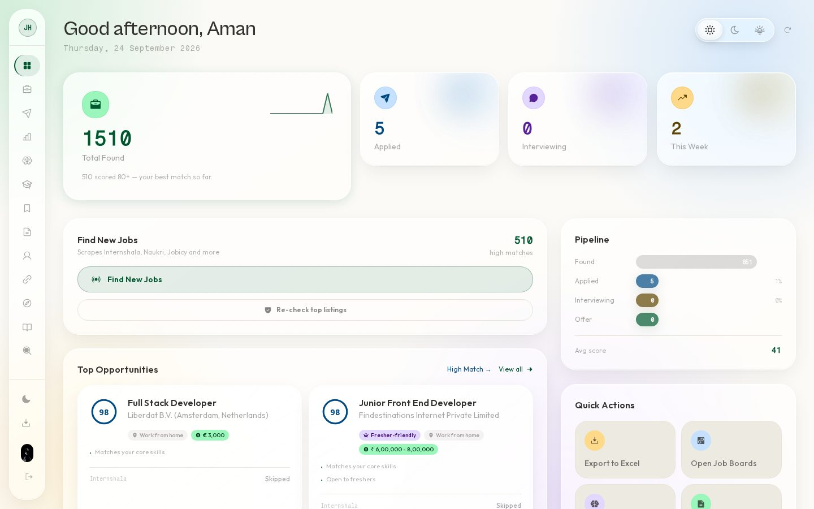

## What it does

| Area | What you get |
|---|---|
| **Discovery** | Concurrent scraping of 19 sources (Internshala, LinkedIn guest search, Cutshort, Talent.com, Shine, Remotive, RemoteOK, WeWorkRemotely, Hacker News "Who is hiring", and more), deduplicated by URL and by title + company across sources. |
| **Scoring** | Two-stage scoring: a fast keyword pass (skills, the listing's real minimum years of experience, full salary range, location) and an LLM re-score for borderline listings. Live progress streams to the dashboard per source and per evaluated job. |
| **Listing checker** | Re-opens the top-scored listings daily: archives ones that closed or went stale, and lowers the score when the live page asks for more experience than the snippet showed. |
| **Applications** | Tailored CV (one page, PDF) and cover letter per job, validated against the resume so no skill the candidate lacks can slip in. Ready-to-copy answers for common application-form questions, follow-up drafts, and batch apply by email, Telegram, or browser pre-fill. |
| **Interview prep** | Per-job prep pack (likely questions with answer outlines, topics to revise, questions to ask), a scored mock-interview trainer across 8 topics, and a STAR story bank. |
| **Learning** | Skill tracker with an AI tutor, PDF book reader, RAG over YouTube playlist transcripts, and an Obsidian vault viewer (callouts, wikilinks, backlinks, search). |
| **Analytics** | Funnel, source ROI, salary insights and weekly activity. |

## Screenshots

| Jobs | Job detail |
|---|---|
| 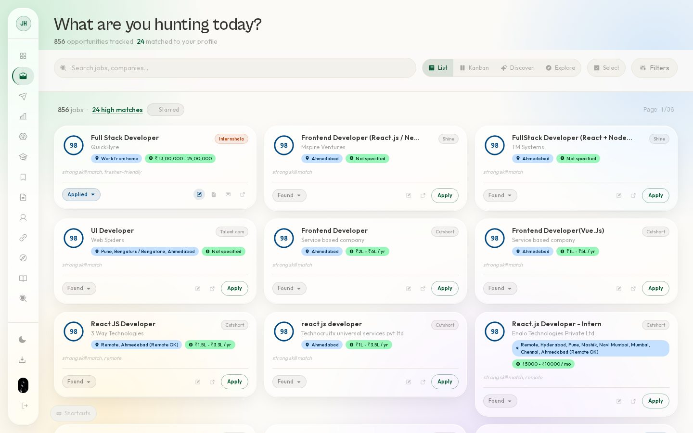 | 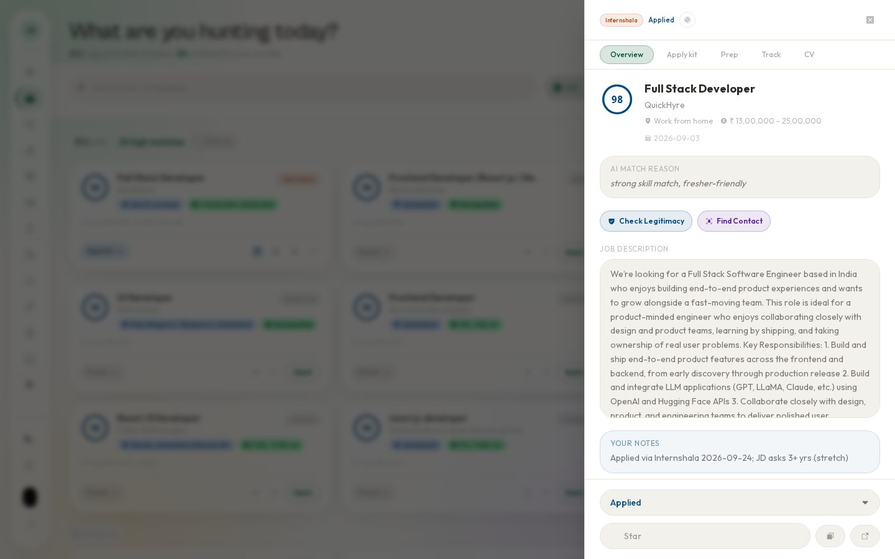 |

| Apply kit (copy-ready form answers) | Interview prep pack |
|---|---|
| 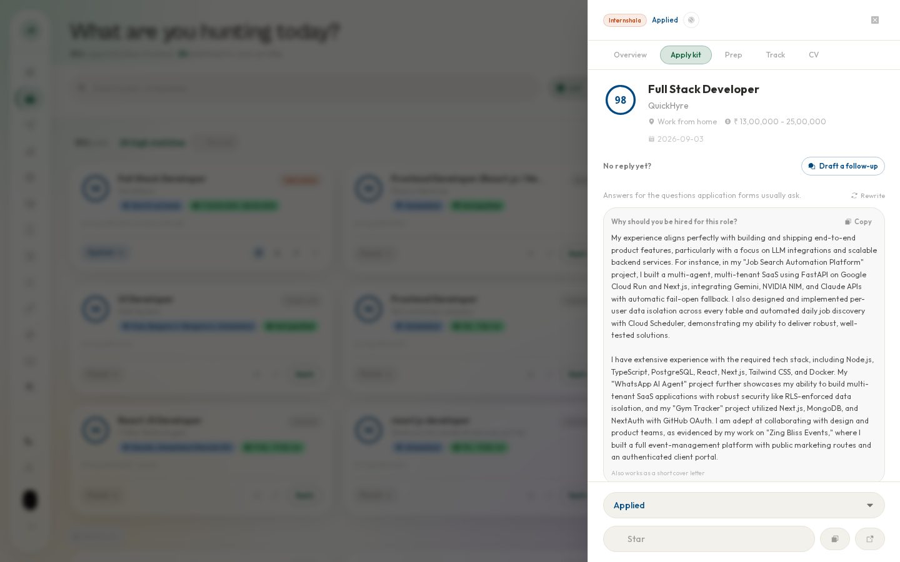 | 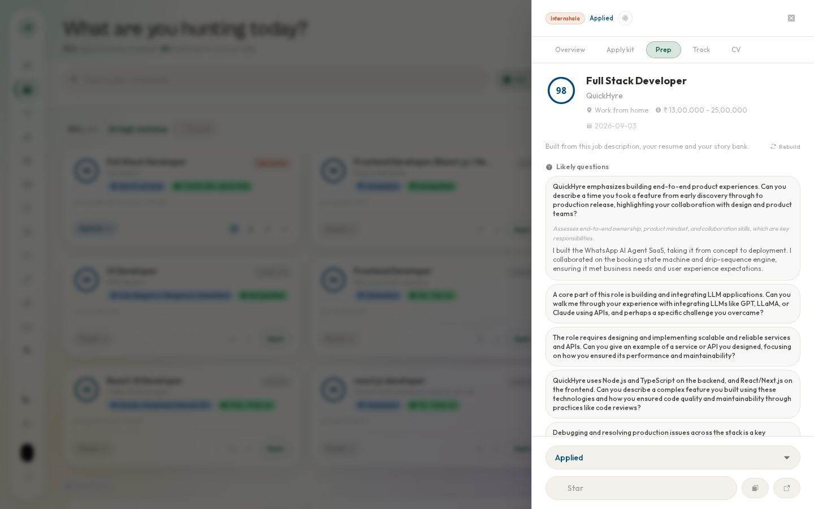 |

| Career analytics | Interview trainer |
|---|---|
| 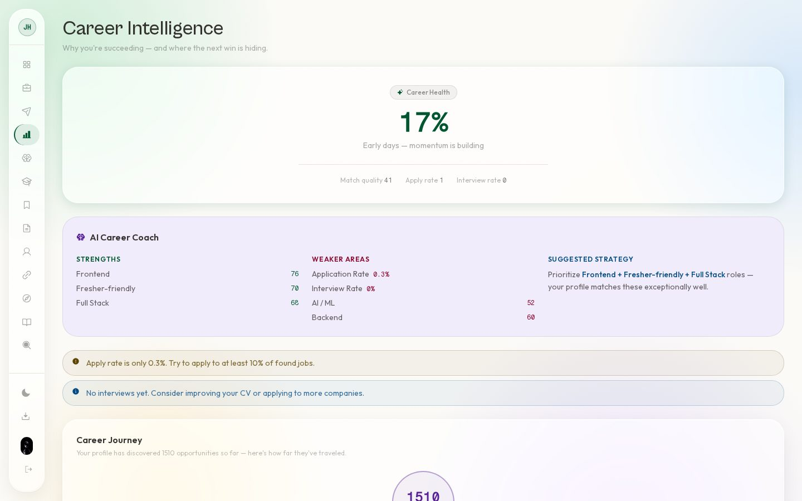 | 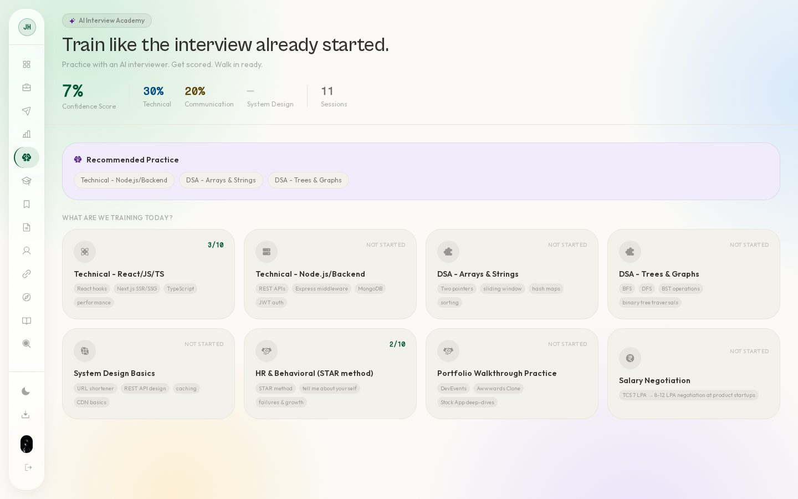 |

| Batch apply | Obsidian vault in Learning |
|---|---|
| 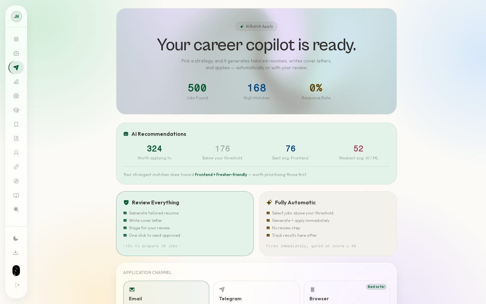 | 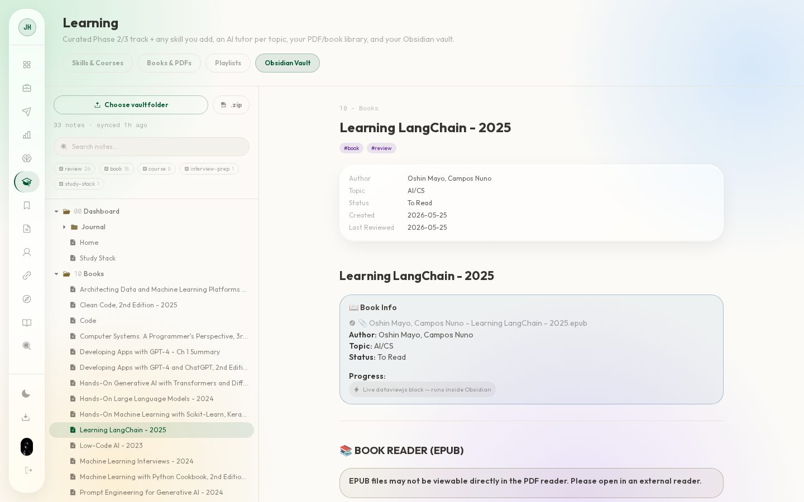 |

| Dim theme | Dark theme |
|---|---|
| 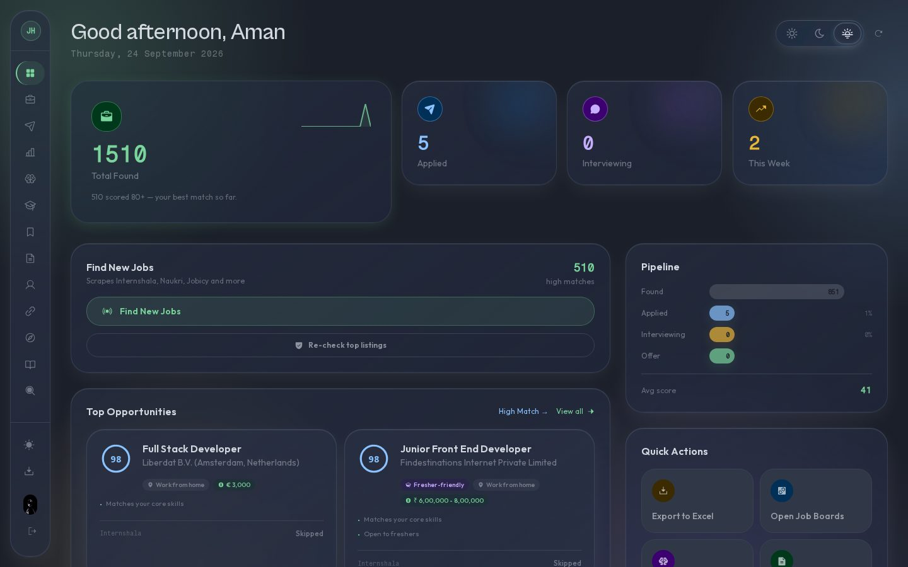 | 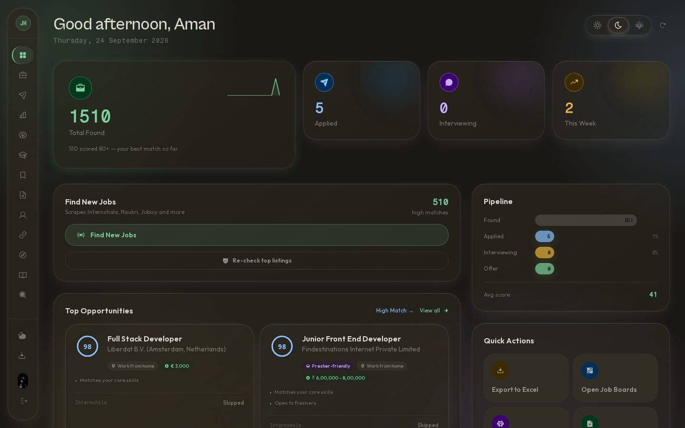 |

| Job board shortcuts | Sign-in | Mobile |
|---|---|---|
| 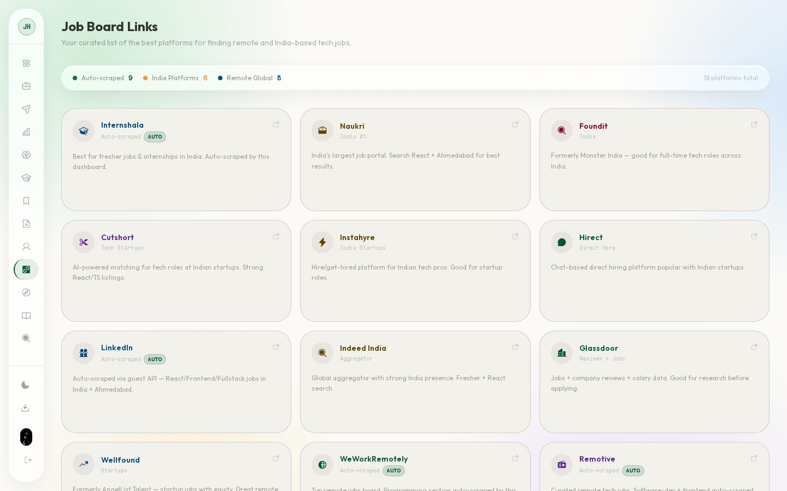 | 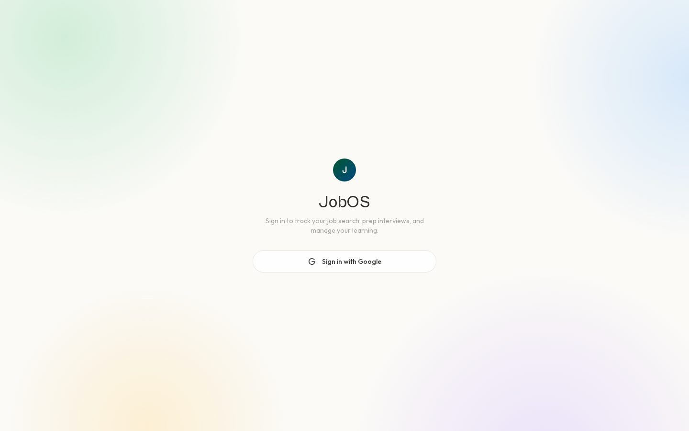 | 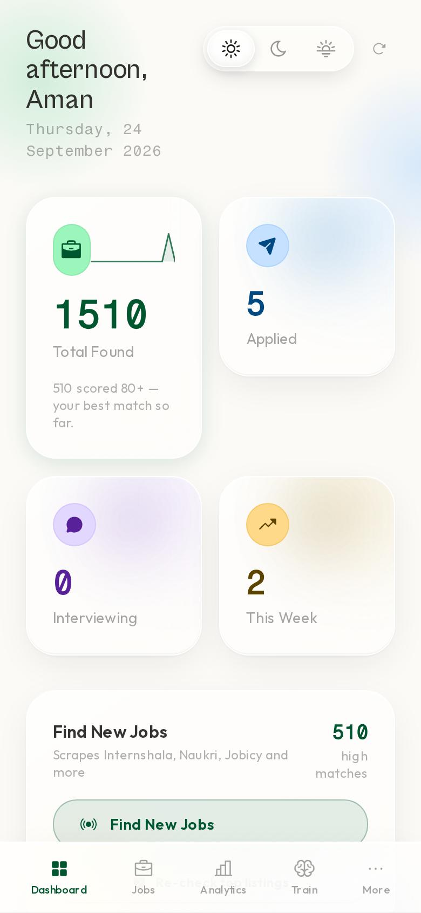 |

## Architecture

```
Browser ── Next.js 14 dashboard (static export, served by a Cloudflare Worker
   │        or Vercel; /api and /auth proxied same-origin for session cookies)
   ▼
FastAPI (Google Cloud Run) ── Postgres (Supabase, per-user rows everywhere)
   ├── agents/job_finder.py      19 scrapers, dedup, two-stage scoring, progress events
   ├── agents/job_quality.py     experience / salary / closed-listing signals
   ├── agents/listing_checker.py daily re-check of top listings
   ├── agents/cv_customizer.py   tailored CV + cover letter -> WeasyPrint PDF
   ├── agents/cv_validator.py    removes unsupported claims, retries, 1-page trim
   ├── agents/application_kit.py form answers, follow-ups, interview prep
   ├── agents/batch_applier.py   email / Telegram / browser pre-fill (never auto-submits)
   ├── agents/trainer.py         mock interviews
   ├── agents/study_agent.py     playlist transcripts -> notes + FAISS RAG
   ├── agents/vault.py           Obsidian vault import
   └── claude_client.py          LLM layer: NVIDIA NIM -> Gemini fallback, rate-limit aware
```

**Stack:** Python, FastAPI, PostgreSQL (Supabase), Next.js 14, TypeScript, Tailwind CSS, GSAP, Framer Motion, Playwright, WeasyPrint, FAISS, Google Cloud Run, Cloud Scheduler, Cloudflare Workers, Docker.

### Engineering notes

- **Multi-tenant isolation.** Google OAuth with JWT session cookies; every table is scoped by `user_id`, covered by integration tests (a cross-tenant PII leak was found and fixed this way).
- **Performance.** Schema setup runs once per process and request handlers run off the event loop; typical API responses are 0.2-0.9 s.
- **LLM reliability.** Provider-agnostic layer that fails over between NVIDIA NIM and Gemini with rate-limit awareness; generated documents are validated against the resume before a PDF is written.
- **Memory-aware PDF rendering.** WeasyPrint replaced headless Chromium after a production out-of-memory crash (about 591 MB for one render against a 512 MB limit).
- **Tests.** 27 pytest cases covering tenant isolation, scoring signals, the listing checker, the CV validator, streaming progress and vault parsing.

## Running locally

Requires Python 3.11+, Node 20+, and `ffmpeg` (Whisper fallback for playlists without captions).

```bash
git clone https://github.com/Aman241104/job-search.git
cd job-search
python scripts/setup.py          # walks through the free-tier accounts below and writes .env
pip install -r requirements.txt
uvicorn app:app --reload         # API on http://localhost:8000
```

```bash
cd web
npm install
echo "NEXT_PUBLIC_API_URL=http://localhost:8000" > .env.local
npm run dev                      # dashboard on http://localhost:3000
```

A CLI covers the daily workflow without the dashboard:

```bash
python main.py find              # scrape and score new jobs
python main.py check             # re-check top listings (closed / stale / over-experienced)
python main.py vault-sync        # import ~/Obsidian Vault notes
python main.py train --topic react
python main.py export            # Excel tracker
```

### Accounts

| Service | Required | Used for |
|---|---|---|
| [Supabase](https://supabase.com) | Yes | Postgres; tables are created on first run |
| [NVIDIA NIM](https://build.nvidia.com) | Yes | Primary LLM (scoring, documents, trainer, tutor) |
| [Google Gemini](https://aistudio.google.com/apikey) | Recommended | Fallback LLM |
| Google OAuth client | For the dashboard | Sign-in |
| Gmail App Password | Optional | Email applications |
| [Adzuna](https://developer.adzuna.com/signup), [Jooble](https://jooble.org/api/about) | Optional | Extra job sources |
| Telegram bot | Optional | Job alerts and status updates from the phone |
| [Cloudinary](https://cloudinary.com) | Optional | Persistent storage for uploaded books |

## Deployment

**API (Cloud Run):**

```bash
gcloud run deploy job-serach-api --source . --region <region> --allow-unauthenticated --memory 2Gi
```

`.gcloudignore` keeps generated CVs, the frontend and tests out of the upload.

**Dashboard (Cloudflare Workers):**

```bash
cd web
npm run cf:deploy     # static export + Worker that proxies /api and /auth to the API
```

Vercel works as well (`vercel --prod`), using Next's rewrites for the same proxying.

## Scope and limitations

- Browser pre-fill never clicks submit, and it cannot fill forms behind a login (Internshala, LinkedIn). Those applications are finished by hand using the generated CV and copy-ready answers.
- Naukri, Indeed and Wellfound block automated access and are offered as manual links instead. Internshala's terms prohibit automated access; its scraper runs at low volume for personal use, which is an acknowledged grey area.
- LLM output is checked against the resume, but prep packs and cover letters should still be read before use.
- Built for one person's search first; the multi-user mode is real but has not been load-tested beyond a handful of accounts.
